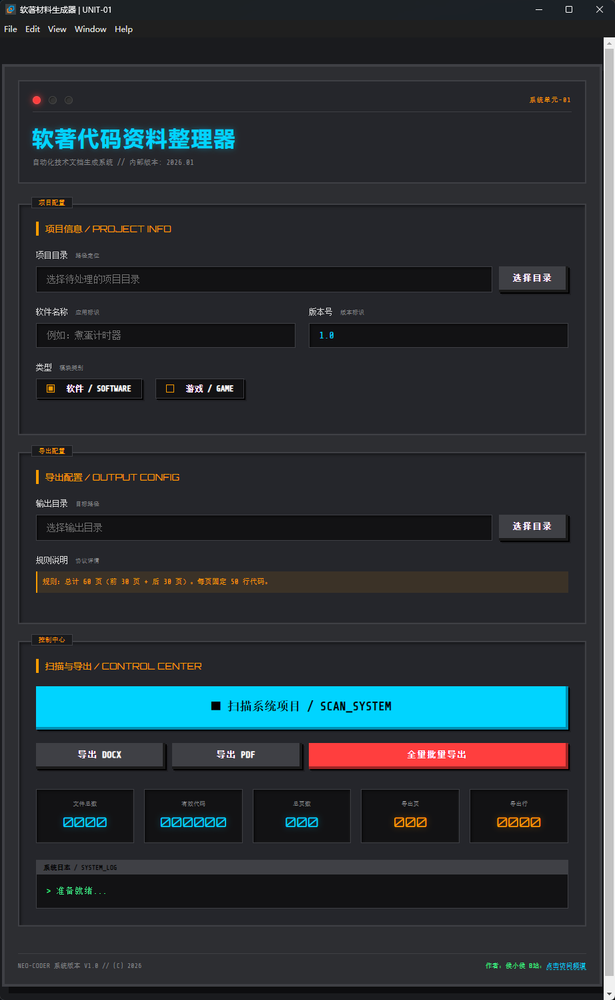
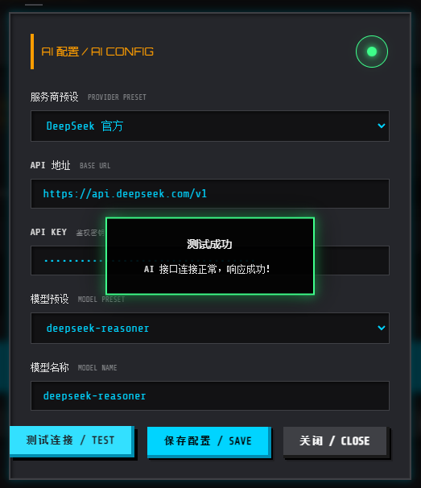
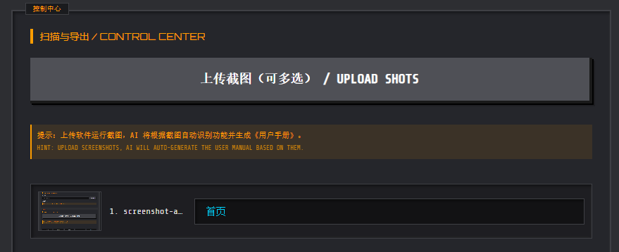
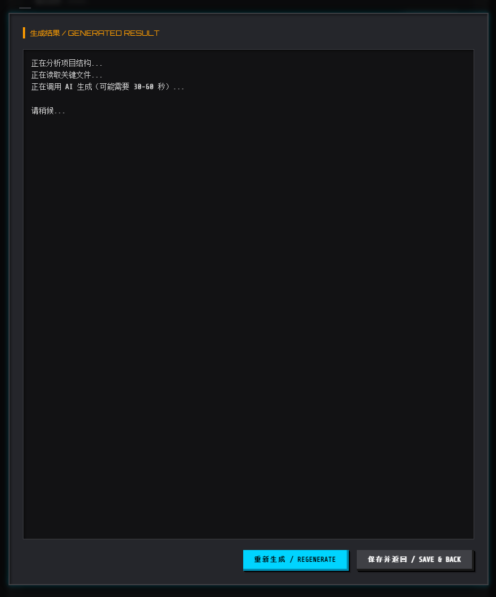
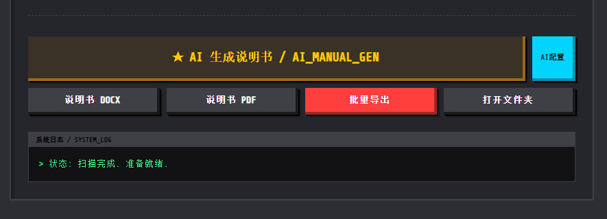
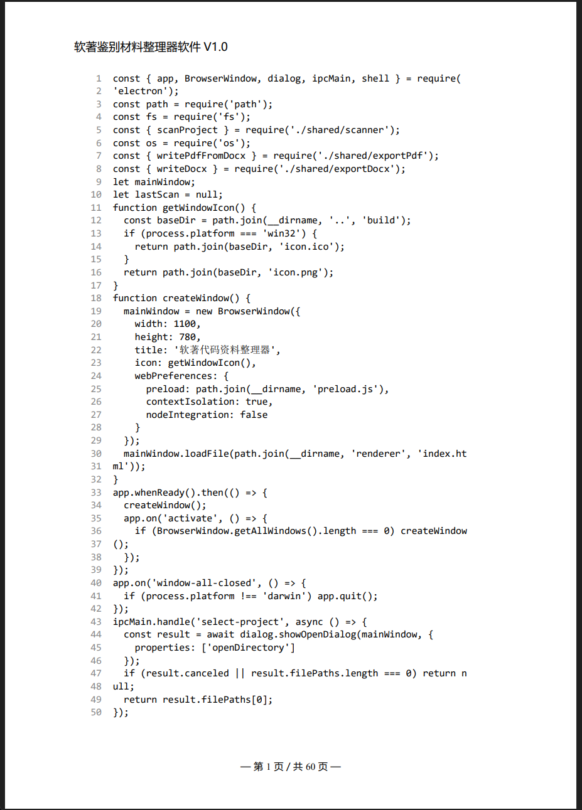
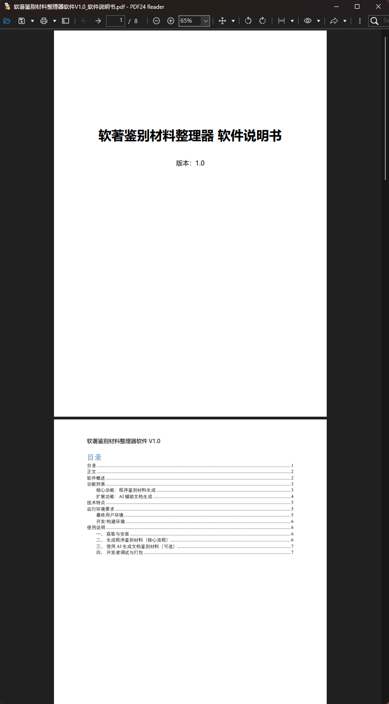

<div align="center">
  
  <h1>软著代码资料整理器</h1>
  <p><b>Softwork Code Organizer</b></p>
  <p>一款自动生成软件著作权登记材料的桌面级工具，支持 AI 辅助生成说明书</p>

  <div>
    
    
    
  </div>
</div>

---

> 如果这款 **软著程序鉴别材料整理器** 对你的软著准备工作有帮助，欢迎在 GitHub 上帮忙点一个 Star，这对持续维护和改进项目是非常大的鼓励。

## 简体中文

### 🌟 项目简介

**软著代码资料整理器** 是专为开发者打造的桌面工具，旨在彻底解决软著申请中“整理代码”和“撰写说明书”的繁琐流程。

- **核心价值**：将数小时的体力活缩短至几分钟。
- **自动化**：一键扫描项目，自动抽取符合规范的代码页。
- **智能化**：利用 AI 视觉与代码分析技术，自动撰写软件说明书。

### 📸 截图预览

<details>
<summary><b>点击展开：主界面与 AI 功能演示</b></summary>

#### 🖥️ 软件主界面 (V1.1.0)


#### 🤖 AI 辅助功能
1. **智能配置**：支持 DeepSeek/OpenAI 等主流模型，内置 3D 状态灯。
   
2. **视觉识别**：批量上传截图，AI 自动识别功能点。
   
3. **分析生成**：深度关联代码与截图，实时展示生成进度。
   
   
4. **在线编辑**：Markdown 实时预览，支持二次调整。
   
</details>

<details>
<summary><b>点击展开：导出结果预览</b></summary>

- **程序鉴别材料 (DOCX)**
  
- **AI 辅助说明书预览**
  
  
</details>

### 📄 示例文件

| 文件类型 | 下载链接 |
| :--- | :--- |
| **程序鉴别材料 (PDF)** | [点击查看](./导出的示例文件/软著鉴别材料整理器软件V1.0_程序鉴别材料.pdf) |
| **程序鉴别材料 (DOCX)** | [点击查看](./导出的示例文件/软著鉴别材料整理器软件V1.0_程序鉴别材料.docx) |
| **软件说明书 (PDF)** | [点击查看](./导出的示例文件/软著鉴别材料整理器软件V1.0_软件说明书.pdf) |
| **软件说明书 (DOCX)** | [点击查看](./导出的示例文件/软著鉴别材料整理器软件V1.0_软件说明书.docx) |

### 🚀 核心特性

#### 1. 程序鉴别材料自动化
- **全语种支持**：js/ts, py, java, c/c++, go, rust, swift 等。
- **智能过滤**：自动剔除 `node_modules`, `dist`, `.git` 等无关目录。
- **规范导出**：严格遵循“前30页+后30页、每页50行”的申报习惯。
- **完美版式**：页眉自动生成，页脚自动页码，Word 原生行号支持。

#### 2. AI 辅助说明书 (V1.1.0 新增)
- **图文联动**：通过截图 OCR 提取功能，结合代码逻辑自动撰写说明。
- **多模态支持**：支持 OpenAI, Claude, Gemini, DeepSeek (SiliconFlow) 等主流 API。
- **即时校验**：内置 3D 状态指示灯，配置是否正确一目了然。

#### 3. 极速发布与更新
- **自动更新**：集成 `electron-updater`，启动即检测，静默下载。
- **CI/CD**：基于 GitHub Actions 的全平台自动构建流水线。

---

### 🛠️ 使用指南

#### 普通用户
1. 前往 [Releases](https://github.com/itxys/softwork-code-organizer/releases) 下载对应平台的安装包。
2. 运行应用，选择项目目录，填写软件信息。
3. 点击“扫描项目”，随后选择导出 DOCX 或 PDF。

#### 开发者
```bash
# 克隆仓库
git clone https://github.com/itxys/softwork-code-organizer.git
cd softwork-code-organizer

# 安装依赖
npm install

# 运行开发环境
npm start

# 构建分发包
npm run build
```

---

## English

### 🌟 Introduction
**Softwork Code Organizer** is a professional desktop tool designed to automate the process of preparing software copyright registration materials.

### 📸 Features
- **Auto-Extraction**: Automatically scans projects and extracts code according to official standards (60 pages total, 50 lines per page).
- **AI Assistant**: Generates user manuals by analyzing screenshots and code logic.
- **Multi-Format**: Supports exporting to DOCX and PDF with perfect formatting.
- **Cross-Platform**: Available for Windows, macOS, and Linux.

### 🛠️ Installation
Download the latest installer from [GitHub Releases](https://github.com/itxys/softwork-code-organizer/releases).

---

## 📄 License
This project is licensed under the MIT License - see the [LICENSE](LICENSE) file for details.
